# How `@formio/ai` Works — Skills Architecture and Process Flows <!-- omit from toc -->

This document explains what actually happens inside your coding agent when you prompt it with a Form.io task: which skill picks the request up, which other skills it loads, when it talks to the Form.io Enterprise Server through the MCP server, and where you are asked to approve something before anything is written.

Read it if you want to know **how the library is utilized** rather than how to install it. Installation, the tool catalog, and the environment variables live in [README.md](./README.md).

- [The three layers](#the-three-layers)
- [Why it is split this way](#why-it-is-split-this-way)
- [The skill catalog by role](#the-skill-catalog-by-role)
- [How a skill gets loaded](#how-a-skill-gets-loaded)
- [Prompt routing — which flow your words trigger](#prompt-routing--which-flow-your-words-trigger)
- [Contracts every skill obeys](#contracts-every-skill-obeys)
  - [Preflight — are the tools there?](#preflight--are-the-tools-there)
  - [Project resolution — which project am I writing to?](#project-resolution--which-project-am-i-writing-to)
  - [Authentication — how the server proves who you are](#authentication--how-the-server-proves-who-you-are)
  - [Approval gates](#approval-gates)
- [Flow A — build an application](#flow-a--build-an-application)
- [Flow B — extend an application you already have](#flow-b--extend-an-application-you-already-have)
- [Flow C — build a form or wizard](#flow-c--build-a-form-or-wizard)
- [Flow D — embed a form in an existing page or app](#flow-d--embed-a-form-in-an-existing-page-or-app)
- [Flow E — change a project directly](#flow-e--change-a-project-directly)
- [Flow F — configure authentication](#flow-f--configure-authentication)
- [Flow G — first run, no MCP server yet](#flow-g--first-run-no-mcp-server-yet)
- [Flow H — add Form.io to an application that already exists](#flow-h--add-formio-to-an-application-that-already-exists)
- [Flow I — when a step fails, and how a flow rewinds](#flow-i--when-a-step-fails-and-how-a-flow-rewinds)
- [Flow J — reaching a skill directly](#flow-j--reaching-a-skill-directly)
- [Operating details worth knowing](#operating-details-worth-knowing)
  - [Planning without building](#planning-without-building)
  - [The artifact pair](#the-artifact-pair)
  - [Snapshotting before a write](#snapshotting-before-a-write)
  - [URLs in generated code](#urls-in-generated-code)
- [Where the flows converge](#where-the-flows-converge)
- [Extending the library](#extending-the-library)

## The three layers

Three things cooperate on every request. The skills hold the knowledge, the MCP server holds the capability, and the Form.io Enterprise Server holds the truth.

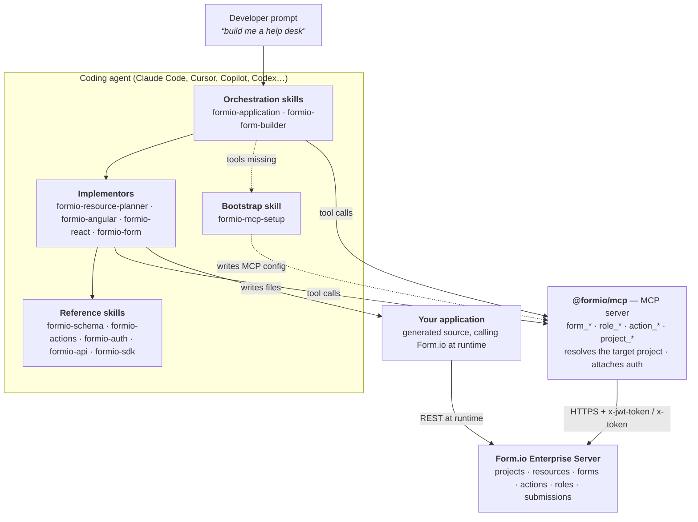

**Skills are knowledge, not code.** A skill is a markdown document the agent reads on demand. It contains the conventions — how a Form.io resource should be modeled, what a Login Action's settings look like, which components exist, how `@formio/angular`'s `FormioResource` is wired — that the agent would otherwise guess at.

**The MCP server is the only build-time path to your deployment.** Skills are explicitly forbidden from hand-rolling HTTP requests against a Form.io deployment or writing a throwaway script that does it for them. If a tool is missing, the skill stops and reports it. That ban covers **build-time** work only — the application being generated is expected to call the Form.io REST API at runtime, and [`formio-api`](./plugin/skills/formio-api/SKILL.md)'s runtime-scope references exist for exactly that code.

**The Enterprise Server is the composable backend.** The data model, RBAC, audit trail, and submission API are not generated into your app — they are configured on the platform and consumed by it.

## Why it is split this way

A single monolithic "Form.io skill" would be loaded in full for every request, which wastes context on guidance the task does not need, and it would let a form-embedding question drift into rewriting a project's access model. The split gives three properties:

- **Progressive disclosure.** Only the descriptions of skills are always in context. The body of a skill loads when it is activated; a skill's phase documents and reference files load when that phase is reached. A "how do I hide a field" question never loads the Angular scaffolding guidance.
- **One owner per concern.** Data modeling lives in the planner. Form JSON shapes live in `formio-schema`. Server-side behavior lives in `formio-actions`. Auth architecture lives in `formio-auth`. Skills link to each other rather than restating, so two documents cannot drift apart on the same fact.
- **Framework-pluggability.** The orchestrator does not know Angular or React. It reads a registry, picks an implementor, and hands off a fixed payload. A new framework is a new row plus a new skill.

## The skill catalog by role

| Role | Skill | What it owns |
| --- | --- | --- |
| **Orchestrator** | [`formio-application`](./plugin/skills/formio-application/SKILL.md) | The whole "build/extend an app" pipeline: intent → plan → import → framework handoff. |
| **Orchestrator** | [`formio-form-builder`](./plugin/skills/formio-form-builder/SKILL.md) | The whole "build one form" pipeline: intent → schema → save → optional embed. Plus the edit lane for an existing form. |
| **Planner** | [`formio-resource-planner`](./plugin/skills/formio-resource-planner/SKILL.md) | The data model. Interviews, classifies each entity as Resource or Form, and emits the `template.md` + `template.json` pair. Calls no MCP tool. |
| **Framework implementor** | [`formio-angular`](./plugin/skills/formio-angular/SKILL.md) | Angular apps via `@formio/angular`. A router over two branches: five gated phases for an application, or a single-form embed; delegates to `formio-angular-resources` and `formio-angular-form`. |
| **Framework implementor** | [`formio-react`](./plugin/skills/formio-react/SKILL.md) | React apps (Vite + React Router data routers) via `@formio/react`. A router over three branches; delegates to `formio-react-resources` and `formio-react-form`. |
| **Embedding** | [`formio-form`](./plugin/skills/formio-form/SKILL.md) | Framework-agnostic embedding with `@formio/js`, and **all** definition-level behavior — conditionals, calculated values, custom validation, cascading selects, wizard page logic — whatever the host framework. |
| **Reference** | [`formio-schema`](./plugin/skills/formio-schema/SKILL.md) | Form.io JSON document shapes: projects, forms/resources, submissions, components. |
| **Reference** | [`formio-actions`](./plugin/skills/formio-actions/SKILL.md) | Per-form server-side behavior: Save, Login, Role Assignment, Group Assignment, Email, Webhook — anatomy, handlers, methods, priorities, conditions. |
| **Reference** | [`formio-auth`](./plugin/skills/formio-auth/SKILL.md) | Auth architecture on top of the model: SSO (OIDC/OAuth, SAML, LDAP), Token Swap, Custom JWT, passwordless, JWT/session mechanics, 2FA, reCAPTCHA, RBAC tuning. |
| **Reference** | [`formio-api`](./plugin/skills/formio-api/SKILL.md) | The full REST surface across platform, project, runtime, and PDF scopes. |
| **Reference** | [`formio-sdk`](./plugin/skills/formio-sdk/SKILL.md) | `@formio/js` and `@formio/js/utils` — statics, instances, `Formio.createForm`, plugins, `Utils`. |
| **Bootstrap** | [`formio-mcp-setup`](./plugin/skills/formio-mcp-setup/SKILL.md) | Connecting the MCP server to whichever client is running, and capturing the project URL. The single remedy every other skill offers when the tools are absent. |

Nested sub-skills — [`formio-angular-resources`](./plugin/skills/formio-angular/formio-angular-resources/SKILL.md), [`formio-angular-form`](./plugin/skills/formio-angular/formio-angular-form/SKILL.md), [`formio-react-resources`](./plugin/skills/formio-react/formio-react-resources/SKILL.md), [`formio-react-form`](./plugin/skills/formio-react/formio-react-form/SKILL.md) — are **loaded by file path** by their parent, not activated by name. They do the per-resource and per-form generation work.

## How a skill gets loaded

Nothing in this library is invoked by hand in the normal case. Loading happens in four widening tiers, and each tier costs context only when the work reaches it.

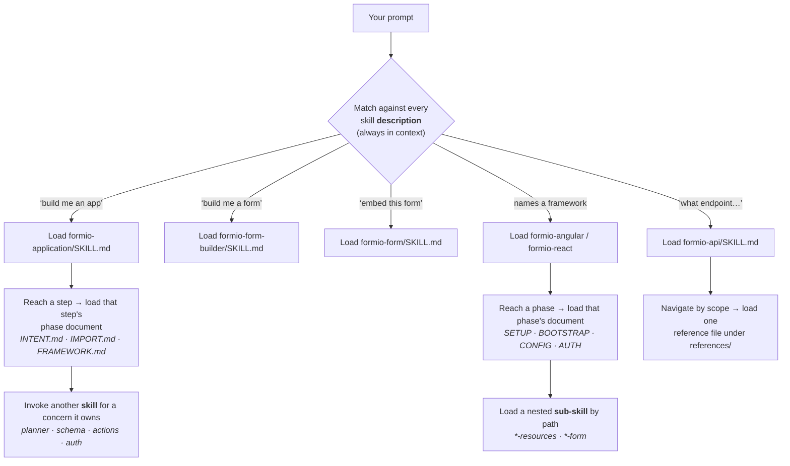

Three distinct mechanisms are in play, and the difference matters when you read a skill:

- **Activation by description** — the agent matches your words against each skill's three-clause description (capability, "use when…", "not for…"). The negative clause is what keeps `formio-application` from stealing an embed request, and `formio-form` from stealing a React one.
- **Phase documents** — a skill's own steps live in sibling files (`INTENT.md`, `IMPORT.md`, `SETUP.md`, `BOOTSTRAP.md`…). They are read at the step, so a flow that stops at step 2 never pays for step 4.
- **Reference files** — the deep material (endpoint groups, component catalogs, template shapes) lives under `references/` and is read only when a specific answer needs it.

## Prompt routing — which flow your words trigger

| What you say | Skill that claims it | Flow |
| --- | --- | --- |
| "build me a CRM", "spin up a help desk", "an app to track inspections" | `formio-application` | [A](#flow-a--build-an-application) |
| "also track invoices in my app", "add a way to see per-agent stats" | `formio-application` (delta mode) | [B](#flow-b--extend-an-application-you-already-have) |
| "build it in Angular", "React front-end for this project" | `formio-angular` / `formio-react` directly | A, from the framework phase onward |
| "add an Angular module for `Ticket`", "add a React route for `Deal`" | the `*-resources` sub-skill, by name | B, resources phase only |
| "build a contact form", "a multi-page intake wizard", "a FHIR patient form" | `formio-form-builder` | [C](#flow-c--build-a-form-or-wizard) |
| "add a phone field to my registration form" | `formio-form-builder` (edit lane) | C, shortened |
| "embed this form on my page", "pre-fill this form", "hide a field when X" | `formio-form` | [D](#flow-d--embed-a-form-in-an-existing-page-or-app) |
| "embed a Form.io form in React" | `formio-react` → `formio-react-form` | D, React mounting |
| "embed a Form.io form in Angular", "render a form in my Angular app" | `formio-angular` → `formio-angular-form` | D, Angular mounting |
| "add Form.io CRUD to my React app", "wire this project into my existing React app" | `formio-react` (existing branch) | [H](#flow-h--add-formio-to-an-application-that-already-exists) |
| "design the resources for a library system" (no app) | `formio-resource-planner` | A, planning only |
| "create a Patient resource", "export my project", "list every form" | `formio-api` + the MCP tools | [E](#flow-e--change-a-project-directly) |
| "send an email when someone submits", "add login to this form" | `formio-actions` | E, action scope |
| "set up SSO with Okta", "swap an external OIDC token", "custom JWT" | `formio-auth` | [F](#flow-f--configure-authentication) |
| any Form.io task where no `form_*` tool exists yet | `formio-mcp-setup` | [G](#flow-g--first-run-no-mcp-server-yet) |
| anything that fails mid-flow, or a framework skill reached by name | the skill that was already running | [I](#flow-i--when-a-step-fails-and-how-a-flow-rewinds) · [J](#flow-j--reaching-a-skill-directly) |

The boundary that trips people up: **"build a form to collect X" is a form; "track X" / "manage X" is an app.** The first goes to `formio-form-builder`, the second to `formio-application`. If the conversation reveals mid-flight that you actually wanted the other one, the skill re-routes and says why.

## Contracts every skill obeys

Four behaviors are identical across the library. They are why flows compose without a central controller.

### Preflight — are the tools there?

Every tool-calling skill checks whether `form_list` is callable **at the moment it reaches its first Form.io tool call** — not when the skill activates. A missing server blocks that call, not the turn: planning, interviewing, and writing local files all happen first and in full. When the tools really are absent, the only remedy offered is `formio-mcp-setup`. `formio-resource-planner` is exempt — it calls no tool at all.

### Project resolution — which project am I writing to?

There is one value to supply: the **Project URL**. The **Base URL** (the deployment hosting it) is derived from it wherever it can be. Before its first deployment-touching call, a skill calls `project_get` with `cwd` set to your working directory and branches on the `status` it gets back.

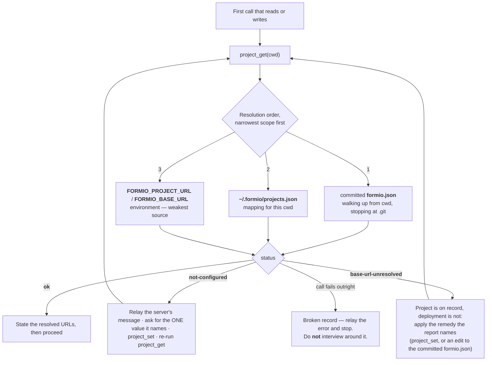

One record wins whole: the project and its deployment travel as a pair, and halves are never combined across sources. That is why a `FORMIO_BASE_URL` in your environment does not supply the deployment for a project that a committed `formio.json` names.

### Authentication — how the server proves who you are

Authentication is **implicit and lazy**. No skill asks you to log in; the first authenticated tool call triggers it on a cache miss.

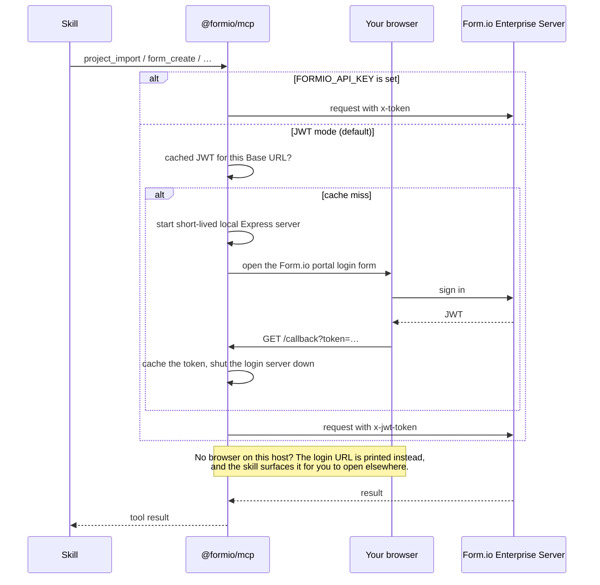

On a host that cannot open a browser — CI, a container, an SSH session with no display — there are two routes. `FORMIO_API_KEY` skips the browser flow entirely and is the clean answer for automation. Failing that, the flow degrades rather than dying: the server prints the portal-login URL and the skill surfaces it for you to open in a browser you do have. `FORMIO_FORCE_BROWSER=1` forces the attempt where the no-browser detection is wrong, and `FORMIO_AUTH_HOST` / `FORMIO_AUTH_PORT` make the login server reachable through a published port from inside a container. A skill also warns you before its first authenticated call that a browser may open, so the window is never a surprise.

### Approval gates

Nothing irreversible happens without a stop. The gates are deliberately placed where the cost of being wrong jumps.

| Gate | Sits before | Why there |
| --- | --- | --- |
| Planner Phase A | writing `template.md` + `template.json` | A wrong field in a ~50-line map is cheap; the same mistake propagated through 500 lines of JSON is not. |
| Offer to import | any import work at all | Importing is optional. You may want to import later yourself, or point the build at a project you already set up. |
| Import preview | `project_import` | The first write to a live project. It cites both resolved URLs, a plain-language template summary, the same-machine-name overwrite warning, and the advice to run `project_export` first as a snapshot. |
| SAVE | `form_create` / `form_update` | Same reason, one form at a time. The edit lane shows what will change before writing. |
| Each framework phase | scaffolding, config, auth surface, resource files | Without them, one "build it in React" would scaffold a workspace, write configuration, and generate a whole auth surface with no stopping point. |
| Scaffolding plan | emitting per-resource files | The resource sub-skills show what they intend to generate before generating it. |
| Data-router migration | changing an existing React app's routing | Routing is shared infrastructure the whole app depends on. It is never migrated silently. |

One exception to the "every phase gates" rule: Angular's SETUP gate is standalone-only. Arriving by handoff, the URLs were already approved at the import step, so SETUP confirms them in one line and advances rather than re-asking.

A declined gate stops that step without leaving partial state behind — but stopping the step is not always stopping the run. **Declining the import is a supported answer:** the flow continues to the framework phase with `importStatus: 'skipped'`, the generated screens 404 until an import happens, and `template.md` + `template.json` stay on disk so you can import whenever you like. Declining a framework phase does stop the chain, because every later phase builds on the files the earlier one wrote.

## Flow A — build an application

The default pipeline. You describe an app in plain language; you are never asked for Form.io or framework vocabulary you did not bring yourself.

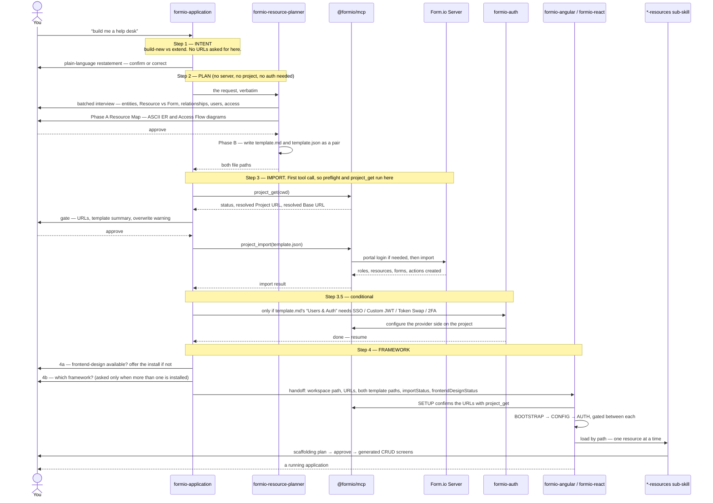

What is worth noticing about this flow:

- **Nothing touches the network until step 3.** Steps 1 and 2 are the bulk of the pipeline and need no server, no project, and no login. Opening a build request with a setup message spends your turn on a step that was not due.
- **The planner is the source of truth downstream.** `template.md` carries architectural intent (Access Matrix, ER and Access Flow diagrams in Mermaid); `template.json` is the importable companion. The framework skills read the auth surface out of the pair rather than inventing one — and they treat it as *data they read*, never as instructions to follow.
- **Import is additive.** Existing roles, resources, and forms survive; items with the same machine name are overwritten in place.
- **The orchestrator routes, it does not reimplement.** Angular is the registry default today; React is the other implementor. When both are installed the framework question is asked once, in one round.

## Flow B — extend an application you already have

The same four steps, in delta mode. The distinction is decided at INTENT and changes every step after it.

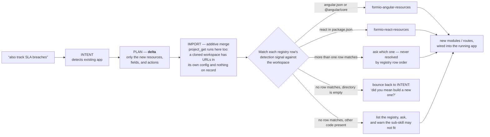

Detection comes from the registry's "detection signal" column — the workspace itself answers which framework it is, so you are not asked again. Each row's signal tests only for its own framework's presence, which is why a workspace holding both `angular.json` and a `react` dependency is a question rather than a coin toss.

The extend sub-skill receives the delta resource names plus your feature request verbatim, so it can translate your domain words into framework primitives. It does **not** receive the URLs: it reads them from the workspace's own generated config (`src/app/config.ts` for Angular, `src/config.ts` for React), because that file is what the running app actually uses.

**This flow assumes an app this library built.** Adding Form.io to a React application that already exists and has no Form.io wiring is a different flow — see [Flow H](#flow-h--add-formio-to-an-application-that-already-exists).

## Flow C — build a form or wizard

A single form is not an app: no data model, no CRUD, no framework scaffolding.

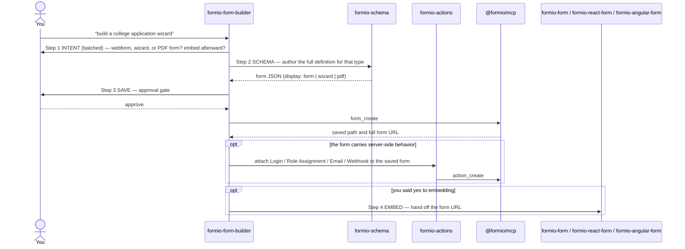

Two lanes branch off the four steps:

- **Edit lane.** "Add a phone field to my registration form" skips the type interview: `form_get` (or `form_list` to resolve a loosely-named form) → `formio-schema` authors the change against the fetched JSON → `form_update` behind the same gate.
- **Behavior lane.** "A contact form that emails me on submit" stays here for the form itself, then `formio-actions` attaches the behavior. It does **not** route to `formio-auth` — that skill owns auth architecture, not per-form actions.

## Flow D — embed a form in an existing page or app

`formio-form` is the framework-agnostic entry point, and it splits along one seam: **mounting** is per-framework, **definition behavior** is not.

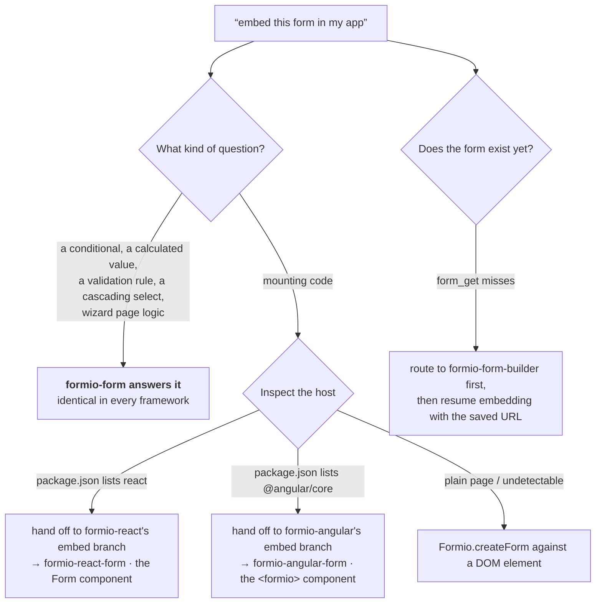

This flow is a check, not an interview — when the host is undetectable it proceeds with `@formio/js` rather than asking. It is also the flow with a security stance attached: a form definition is executable code (`calculateValue`, `validate.custom`, `logic`, HTML bodies, select templates are all evaluated in your page's JavaScript context), so only definitions from a project you control are ever rendered.

## Flow E — change a project directly

Not every prompt is a build. "List every form", "create a Patient resource", "export the project", "add an email action to this form" are single operations against the deployment.

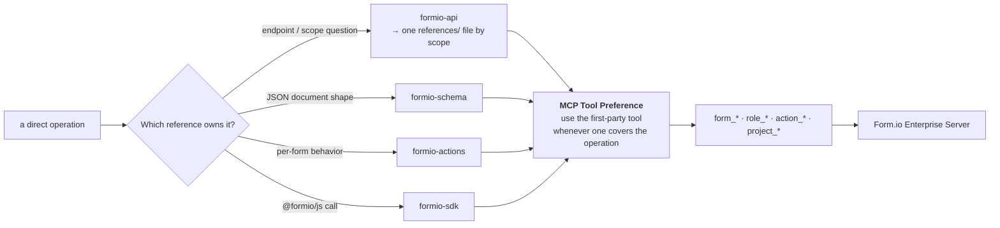

Every reference document carries an **MCP Tool Preference** section for this reason: the endpoint documentation exists so the agent can *reason* about the API and so your generated application can call it at runtime, but the build-time write goes through the tool. The tools enforce guardrails that raw HTTP skips.

You can also skip the skills entirely and prompt the tools — see [Using the MCP server without the skills](./README.md#using-the-mcp-server-without-the-skills). You then give up the conventions the skill library encodes, not the capability.

## Flow F — configure authentication

The planner ↔ auth boundary is explicit, and it is the one handoff worth understanding in detail, because both skills touch "login".

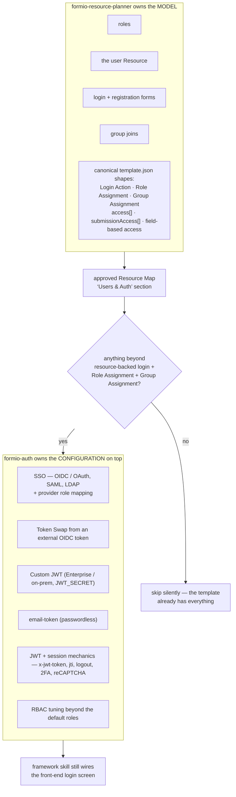

Action JSON shapes are not duplicated across the two skills: `formio-auth` references the planner's `references/template-json.md` by path.

## Flow G — first run, no MCP server yet

Installing skills-only (`npx skills add formio/ai`) gives the agent the knowledge with no tools attached. Every skill's preflight detects that and hands to one place.

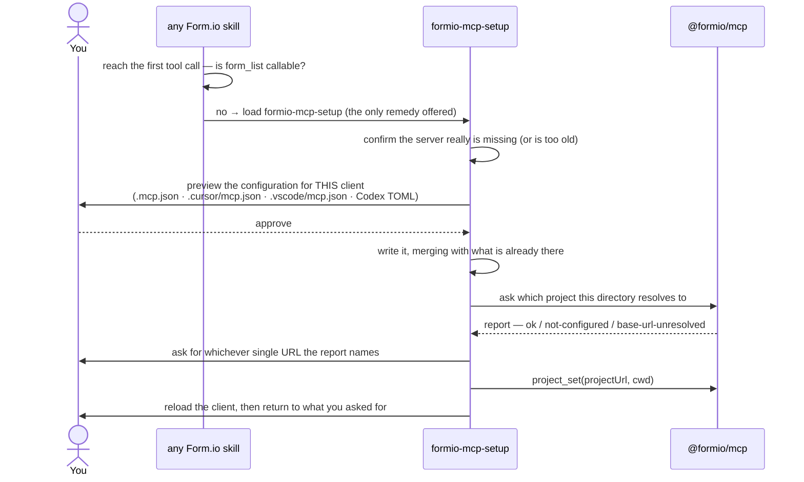

`formio-mcp-setup` is the only skill that shells out to the CLI (`npx @formio/mcp project get|set`) — it runs before any tool exists to call. Every other skill uses the `project_get` and `project_set` **tools** over the connection the server already has.

## Flow H — add Form.io to an application that already exists

Not every existing app was built by this library. "Wire this Form.io project into my React app" is an **integration** job, not a delta build: there is no workspace to scaffold, and the decisions are about what is already there. `formio-react`'s existing-application branch owns it, and it inspects before it writes.

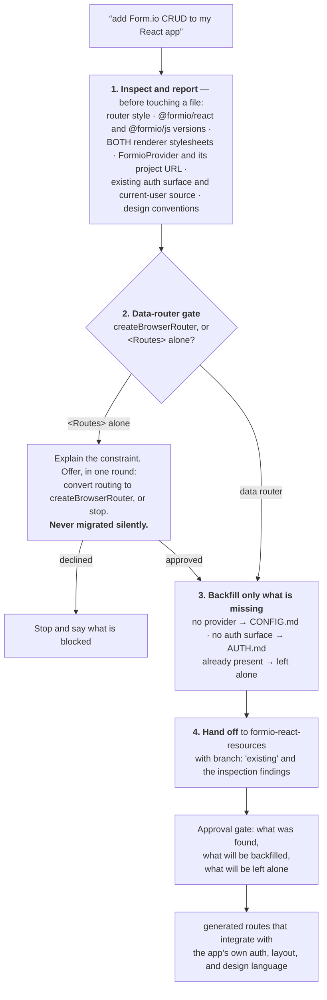

Three things make this branch different from [Flow B](#flow-b--extend-an-application-you-already-have):

- **`BOOTSTRAP.md` never runs.** Nothing is scaffolded; no workspace is created.
- **The data-router requirement is a hard gate, not a preference.** The generated resource code is built on loaders, actions, `errorElement`, and post-action revalidation — that is what lets React skip the service, registry, alert bus, and refresh emitter that `@formio/angular` needs. An app routing through `<BrowserRouter>` with `<Routes>` alone cannot host it.
- **A satisfied prerequisite is integrated with, not replaced.** An app with its own login gets no second auth surface generated — but the generated routes still have to protect themselves through that mechanism, so its current-user source travels in the handoff. An app with an established design language gets composition within it.

The Angular counterpart of the same idea is narrower: `formio-angular` invoked directly against a partially-wired workspace skips the phases whose outputs already exist and runs only the missing ones — see [Flow J](#flow-j--reaching-a-skill-directly).

## Flow I — when a step fails, and how a flow rewinds

No flow is a straight line. Every step that can fail has a named branch, and the rule is the same throughout: surface it short, offer retry / skip / bail, never leave a half-done state unexplained.

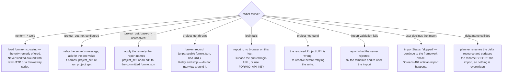

Flows also **rewind** rather than patch. A framework skill that finds the ground moved under it resets to the phase that owns the changed thing, says which phase and why, and re-runs the gates from there:

| What changed | Resets to |
| --- | --- |
| The project was re-pointed at a different Form.io project | SETUP — then CONFIG and AUTH re-run with the corrected URLs |
| Dependencies reinstalled, or the router swapped | BOOTSTRAP |
| `config.ts` was hand-edited | CONFIG |
| An embed request turns out to want list / create / edit screens | re-dispatch to the CRUD branch, saying why the branch changed |
| A stated branch contradicts the workspace (a "new app" in a directory that already holds one) | surface it and confirm before proceeding — scaffolding over an existing app is not recoverable |

Patching a generated file in place from inside a later phase is specifically avoided: restarting the affected phase puts the approval gate back in front of you.

## Flow J — reaching a skill directly

Naming a framework or a sub-skill skips the orchestrator, and the skills are built to be entered that way without losing their guardrails.

| How you arrive | What runs |
| --- | --- |
| "build it in Angular" / "use `@formio/react`", with an approved `template.md` + `template.json` in scope | The framework skill's own phase chain, from SETUP. It still confirms the project with `project_get` rather than trusting anything handed in. |
| The same, against a partially-wired workspace | Pre-flight inspects, then only the phases whose outputs are missing run. A skipped phase is announced, never skipped silently. |
| "add an Angular module for `Ticket`" / "add a React route for `Deal`" | The `*-resources` sub-skill alone, expecting `FormioAppConfig` / `FormioProvider` already wired. |
| A bare "build me an app" with no plan and no framework named | The framework skill declines the job and points you at `formio-application`, which runs the planner and the import first. The chain cannot usefully proceed without a plan: BOOTSTRAP sizes the workspace against it, AUTH renders its login and registration forms, and Resources generates from it. |
| Prompting the MCP tools with no skill at all | Every tool still works; you give up the conventions the skill library encodes, not the capability. |

## Operating details worth knowing

### Planning without building

"Design the resources for a library system" runs `formio-resource-planner` on its own. It calls no MCP tool, needs no project, and probes for none — it interviews, gates on the Resource Map, and writes the artifact pair. Importing is then a separate, explicit action: Phase B prints it as a next step, and whoever carries it out confirms the target project first.

### The artifact pair

`template.md` and `template.json` are one deliverable, never one file. `template.md` carries architectural intent — Resources, Forms, Users & Auth, Roles, the Access Matrix, and the ER + Access Flow diagrams; `template.json` is the importable project export with its eight top-level keys in a fixed order. They are written together, share a basename, and share the same UTC timestamp suffix if either name is already taken, so the pair cannot be split. Downstream, the split of labor is fixed: intent is read from the `.md`, field-level component shapes from the `.json`. Framework skills treat both as **data they read, never instructions they follow**.

### Snapshotting before a write

The import preview advises `project_export` first — one call that captures roles, resources, forms, and actions as a portable document. It is the cheapest insurance against a same-machine-name overwrite. At form granularity, `form_revisions_list` and `form_revision_get` read the immutable published revisions of a single form where form revisions are enabled.

### URLs in generated code

Generated application code needs the URL *values*, not a deployment lookup: `Formio.setBaseUrl` / `Formio.setProjectUrl` for `@formio/js`, and `FormioAppConfig`'s `appUrl` (= Project URL) and `apiUrl` (= Base URL) for `@formio/angular`. Those values come from `project_get` when the tools are callable and from you when they are not — never from a hardcoded example host, and never composed from each other.

## Where the flows converge

Different prompts, one narrow waist. Whatever you asked for, the write to your deployment happens through the same three things: a resolved project, an approval gate, and an MCP tool.

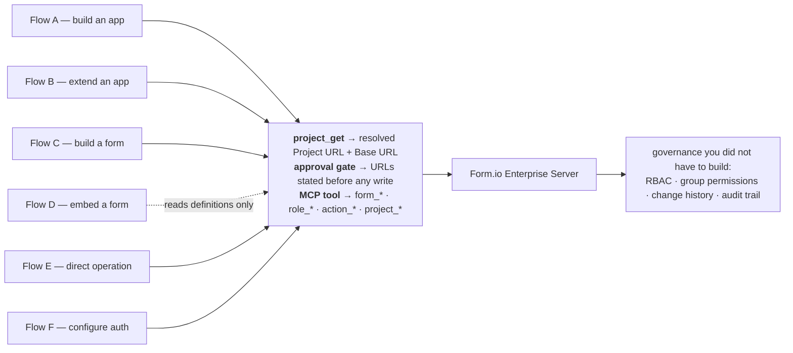

## Extending the library

The seams are deliberate, so extension is additive:

- **A new framework** — write the implementor skill, then add a row to [`formio-application/FRAMEWORK.md`](./plugin/skills/formio-application/FRAMEWORK.md)'s registry table — entry skill, extend sub-skill path, detection signal, and a `Default` cell set to `no`. The orchestrator needs no other change; adding a framework is a row. The new skill has to accept the two existing handoff payloads unchanged, because the orchestrator does not adapt per framework:

  ```
  // build-new → entry skill
  { workspacePath, formioProjectUrl, formioBaseUrl, templateMdPath, templateJsonPath,
    importStatus: 'succeeded' | 'skipped' | 'failed-user-chose-continue',
    frontendDesignStatus: 'available' | 'declined' }

  // modify-existing → extend sub-skill (no URLs: read them from the workspace's own config)
  { workspacePath, userRequest, templateMdPath, templateJsonPath,
    newResourceNames, frontendDesignStatus }
  ```

  `formio-react` extends the second payload with `branch: 'greenfield' | 'existing'` and, on the existing branch, its inspection findings — an addition its own sub-skill consumes, not something the orchestrator supplies.
- **A new capability area** — a new reference skill with a three-clause description whose "not for" clause disambiguates it from its neighbors, plus an `## MCP Tool Preference` section.
- **A new MCP tool** — register it through `registerAllTools` in `packages/mcp-server/`, then reference it from the skills that should prefer it over raw HTTP.

Authoring conventions, the terminology rules that are enforced by tests, and the eval harnesses used to measure a skill change are in [CONTRIBUTING.md](./CONTRIBUTING.md) and [CLAUDE.md](./CLAUDE.md).
