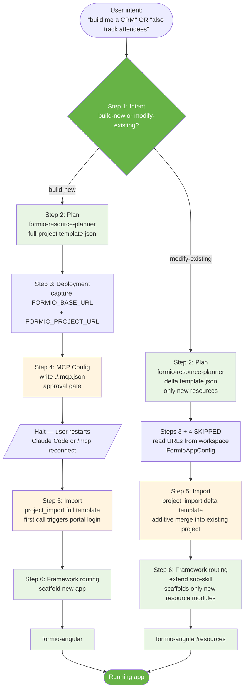
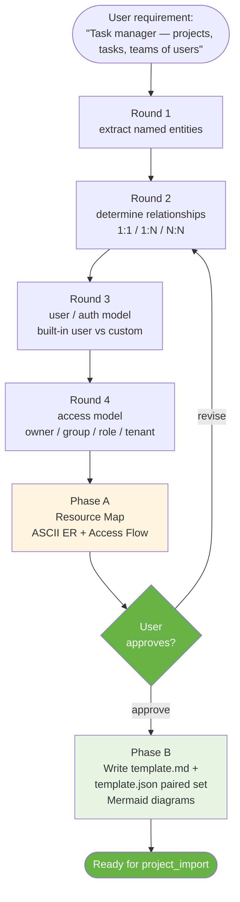
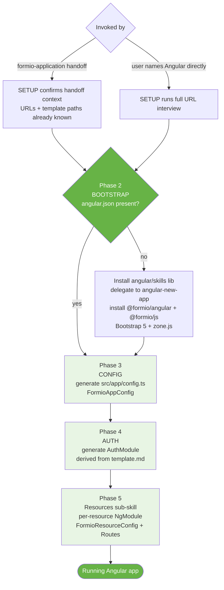
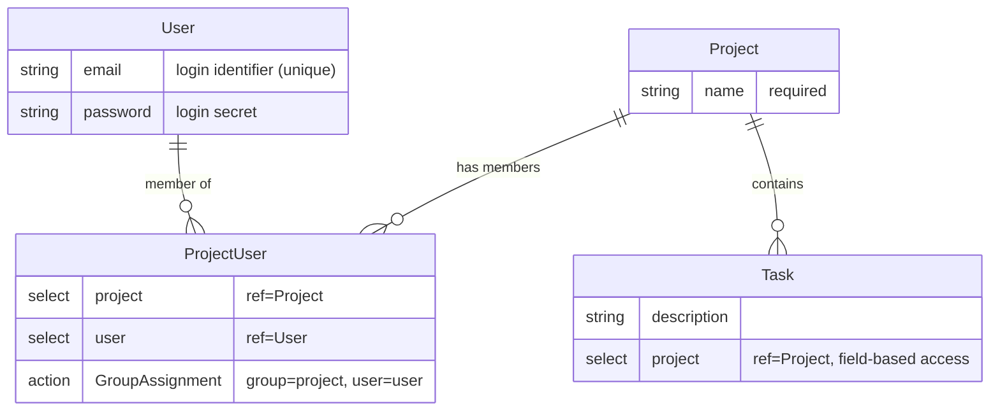
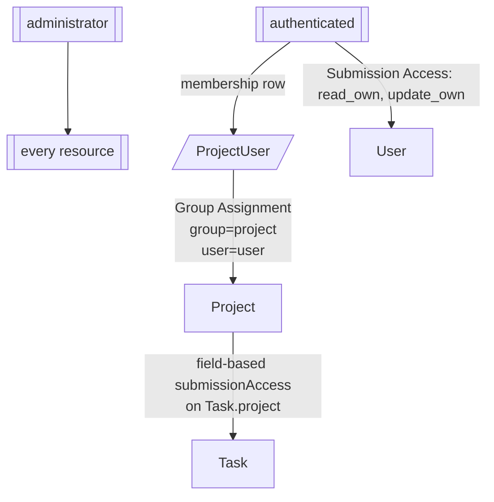
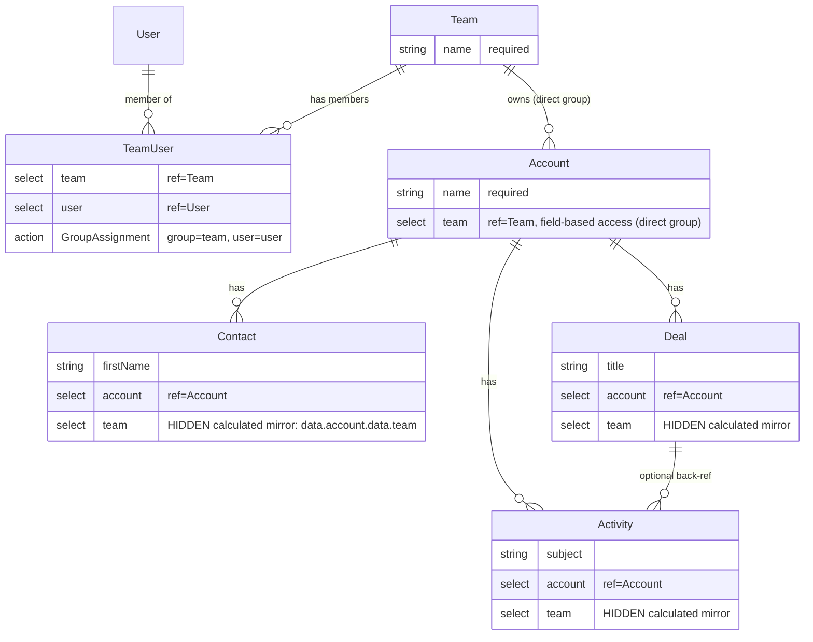
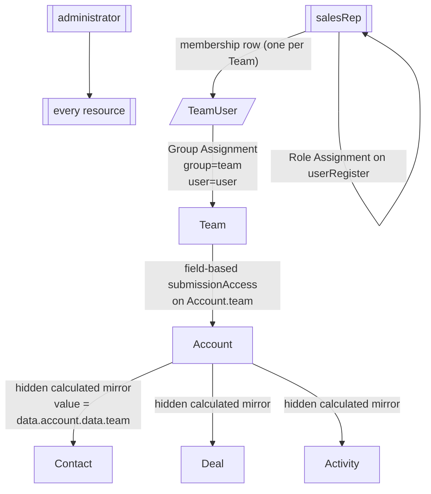

# Form.io AI

> **Form.io concepts, fluent in your AI agent.** `@formio/ai` is a Claude Code plugin, a [Model Context Protocol](https://modelcontextprotocol.io/) server (`@formio/mcp`), and a multi-skill library that teach an AI agent every primitive of the [Form.io](https://form.io) platform — resources, forms, submissions, role-based access control, group permissions, field-based ACLs, server-side actions, project templates, and renderer wiring — so the agent designs, builds, and extends enterprise-grade business-process applications correctly the first time.

The library is built around a simple thesis: **Form.io is a deep platform, and an agent that does not understand it will produce shallow, insecure apps.** Out of the box, an LLM does not know what a Group Assignment action is, when to mirror a `team` select onto a grandchild resource for transitive access, or why a missing Save Submission action silently breaks a resource. `@formio/ai` closes that gap. With it loaded, your agent reasons in Form.io primitives the same way it reasons about React components or SQL tables.

The result: every app your agent builds with this library — whether scaffolded soup-to-nuts from one prompt, extended with a single new resource, or surgically modified by editing a single component — incorporates **robust RBAC, role-and-group-based permissions, and field-level access controls by default.** Security is not a follow-up task; it is what the planner and the orchestrator emit on every run.

| Layer | Package / Path | Purpose |
| --- | --- | --- |
| **Claude Code plugin** | `@formio/ai` ([`plugin/`](./plugin/)) | One-command install. Bundles the MCP server + the entire skill library and registers them with Claude Code. |
| **MCP server** | `@formio/mcp` ([`packages/mcp-server/`](./packages/mcp-server/)) | First-party Form.io operations exposed as MCP tools (`form_*`, `role_*`, `action_*`, `project_*`). Usable from any MCP-aware client (Claude Code, Claude Desktop, VS Copilot, etc.) — not Claude-only. |
| **Skills library** | [`plugin/skills/`](./plugin/skills/) | Seven activatable skills covering app orchestration, resource planning, framework scaffolding, form-JSON authoring, action configuration, and the full Form.io REST surface. |

---

## Table of contents

- [What this library is for](#what-this-library-is-for)
- [Use cases](#use-cases)
- [Quickstart — Claude Code plugin](#quickstart--claude-code-plugin)
- [Quickstart — standalone MCP server](#quickstart--standalone-mcp-server)
- [How it works](#how-it-works)
  - [The `formio-application` flow](#the-formio-application-flow)
  - [The `formio-resource-planner` two-phase flow](#the-formio-resource-planner-two-phase-flow)
  - [The `formio-angular` five-phase flow](#the-formio-angular-five-phase-flow)
- [Sample resource maps](#sample-resource-maps)
  - [Task manager (group-via-join)](#task-manager-group-via-join)
  - [CRM with transitive group access](#crm-with-transitive-group-access)
- [Skills library](#skills-library)
- [MCP server tools](#mcp-server-tools)
- [Authentication](#authentication)
- [Environment variables](#environment-variables)
- [Development](#development)
- [Spec-driven development with OpenSpec](#spec-driven-development-with-openspec)
- [License](#license)

---

## What this library is for

`@formio/ai` introduces Form.io to agentic coding workflows. The skills cover the full mental model an enterprise Form.io developer carries — and the MCP tools give the agent direct, authenticated access to the running platform — so the agent can:

- **Reason about the data model** as resources, sub-resources, and join resources rather than generic tables.
- **Apply RBAC correctly** by default — Roles, Group Assignment actions, field-based `submissionAccess`, owner-vs-group-vs-role-vs-tenant access strategies, transitive group propagation through hidden calculated mirrors.
- **Wire authentication** via the built-in `user` resource or a custom user resource, with Login + Role Assignment actions, self-register vs admin-invite flows, and the right anonymous/authenticated/admin role layering.
- **Configure server-side behavior** through actions — email, webhook, save, login, role assignment, group assignment, reset password — with the right handler/method/priority/condition combinations.
- **Author and edit form JSON** — every component type, validation rule, conditional logic expression, calculated value, and field-based access block.
- **Operate the running platform** through first-party MCP tools (`form_*`, `role_*`, `action_*`, `project_*`) instead of brittle raw HTTP, with implicit JWT auth via the portal-login flow.
- **Navigate the full REST surface** — platform admin, project admin, runtime/end-user, PDF — when an MCP tool does not yet cover an operation.

Agents loaded with `@formio/ai` produce enterprise-grade applications: every resource ships with a Save Submission action so submissions actually persist; every authenticated role inherits its access through documented Group / Field-based / Role mechanics; every front-end component is scaffolded against `@formio/angular` with `FormioAuthConfig` and `FormioResourceConfig` derived directly from the planner's `template.json`.

## Use cases

A Form.io developer working with an `@formio/ai`-equipped agent can drive any of the following from a single conversation. Each example is a real prompt — paste it into Claude Code with the plugin installed.

### 1. Plan a data model from plain language

> "Plan the resource structure for a multi-tenant booking system where customers book services from providers, providers belong to one or more locations, and admins manage everything."

The `formio-resource-planner` skill activates, runs its five-round interview, and emits a `template.md` (architectural intent — Resources, Users & Auth, Roles, Access Matrix, ER diagram, Access Flow diagram) plus a paired `template.json` ready for `project_import`.

### 2. Build a complete app soup-to-nuts from one prompt

> "Build me a CRM where sales reps only see accounts owned by the teams they belong to."

The `formio-application` orchestrator runs the full six-step pipeline (Intent → Plan → Deployment → MCP Config → Import → Framework). At the end you have a Form.io project loaded with resources, roles, and actions plus an Angular workspace wired to it.

### 3. Extend a running app with a new feature

In an existing workspace already wired to a Form.io project:

> "Also let customers leave reviews on each completed booking, and let providers reply to them."

The orchestrator switches to **modify-existing** mode, plans a delta `template.json` (only the new resources/fields/actions), additively imports it, and hands off to the framework's extend sub-skill to scaffold modules for exactly the new resources. The existing project content is preserved.

### 4. Generate a single form JSON definition

> "Using the formio-form skill, generate a JSON schema for a wizard-style insurance claim form with personal info on page 1, incident details on page 2, and supporting documents on page 3."

`formio-form` + `formio-schema` produce a full Form.io form definition — components, validation, conditional logic, page panels — that you can post via `form_create` or paste into the form builder.

### 5. Add server-side behavior to an existing form

> "On the contractRequest form, send an email to legal@example.com whenever status changes to 'pending review', and save a copy of the submission to the auditLog resource."

`formio-actions` chooses the right action types (Email + Save Submission), recommends handler/method/priority, and the agent attaches them via `action_create`.

### 6. Tighten access controls on an existing resource

> "Currently anyone authenticated can read every Account. Lock it down so reps only see Accounts owned by their Team."

The agent reads the resource via `form_get`, modifies `submissionAccess` to use a field-based ACL on `Account.team`, and ensures the join resource has a Group Assignment action — emitting the diff for your review before calling `form_update`.

### 7. Generate a CRUD UI module against an existing resource

> "Generate the Angular module for the Invoice resource — list view, view-edit-create routes, and a form component using `<formio>`."

`formio-angular` + its `resources` sub-skill scaffold the NgModule, `FormioResourceConfig`, `FormioResourceRoutes()`, list-view template, and per-component HTML/SCSS — all `standalone: false` to match the official `@formio/angular` demo, with Bootstrap 5 styling.

### 8. Inspect and operate a live project

> "List every form in this project that does NOT have a Save Submission action attached."

The agent calls `form_list` + `action_list` per form via the MCP server, surfaces the orphans, and offers to attach the missing action with `action_create`.

### 9. Snapshot, diff, and migrate between projects

> "Export the staging project, diff it against production, and tell me what's drifted."

`project_export` produces a portable template; the agent diffs and reports drift. A subsequent `project_import` against production additively merges the agreed changes.

### 10. Look up any Form.io REST endpoint

> "How do I PATCH a single field on a submission with revisions enabled?"

The `formio-api` router activates, navigates into `runtime-submissions.md`, and returns the exact endpoint, headers, body shape, and the preferred MCP tool when one exists.

---

---

## Quickstart — Claude Code plugin

The fastest way to get started. From inside Claude Code:

```text
/plugin marketplace add git@github.com:formio/ai.git
/plugin install formio-ai@formio
```

Claude Code prompts for `FORMIO_BASE_URL` and `FORMIO_PROJECT_URL` on install. Then describe what you want:

> "Build me a task manager where each project has its own team of users, and users only see tasks inside projects they belong to."

The `formio-application` skill activates, runs the planner, captures URLs, imports the template, and hands off to `formio-angular` to scaffold the Angular front-end. Each step has an approval gate.

To extend an existing app, just describe the new feature in the same workspace:

> "Also let team members add comments to each task."

The same skill switches to **modify-existing** mode — plans only the new resources (delta `template.json`), additively imports them, and hands off to the Angular extend sub-skill to scaffold modules for exactly the new resources.

---

## Quickstart — standalone MCP server

The MCP server (`@formio/mcp`) is independently usable from any MCP-aware client. From a clone of this repo:

```bash
pnpm install
pnpm --filter @formio/mcp dev
```

The server starts on port 3000. Override with the `PORT` env var.

### Transports

| Transport | Endpoint | Compatible with |
| --- | --- | --- |
| Streamable HTTP | `POST /mcp` | Claude Code, VS Copilot, modern MCP clients |
| SSE | `GET /sse` + `POST /messages` | Claude Desktop, legacy MCP clients |
| stdio | `node dist/stdio.js` | `.mcp.json` spawn-mode clients |

### Connect to Claude Code

```json
{
  "mcpServers": {
    "formio-mcp": {
      "type": "http",
      "url": "http://localhost:3000/mcp"
    }
  }
}
```

### Connect to Claude Desktop

`claude_desktop_config.json`:

```json
{
  "mcpServers": {
    "formio-mcp": {
      "url": "http://localhost:3000/sse"
    }
  }
}
```

### Spawn via `.mcp.json` (stdio)

```json
{
  "mcpServers": {
    "formio-mcp": {
      "command": "npx",
      "args": ["-y", "@formio/mcp"],
      "env": {
        "FORMIO_BASE_URL": "https://api.form.io",
        "FORMIO_PROJECT_URL": "https://your-project.form.io"
      }
    }
  }
}
```

In standalone (non-plugin) mode, `FORMIO_BASE_URL` and `FORMIO_PROJECT_URL` are required env vars. In plugin mode, the plugin manages both via Claude Code's user-config + per-cwd `~/.formio/projects.json` mapping.

---

## How it works

Three skills do the heavy lifting on a build. The orchestrator (`formio-application`) routes work; the planner (`formio-resource-planner`) designs the data model; the framework implementor (`formio-angular`) scaffolds the front-end.

### The `formio-application` flow

`formio-application` is the default "build me an app" entry point. It runs a six-step orchestration with approval gates at every write. **Build-new** runs all six. **Modify-existing** skips Deployment + MCP Config (URLs already known) but still plans (delta) and still imports (additive).



| Step | Build-new | Modify-existing |
| --- | --- | --- |
| 1. Intent | Identify build-new | Identify modify-existing |
| 2. Plan | Full-project `template.md` + `template.json` | Delta — only new resources/fields/actions |
| 3. Deployment | Capture URLs (one batched `AskUserQuestion`) | Skipped — read URLs from workspace `FormioAppConfig` |
| 4. MCP Config | Write `./.mcp.json`, halt for restart | Skipped — `.mcp.json` already in place |
| 5. Import | Additive `project_import` (first call triggers portal login) | Additive `project_import` of delta |
| 6. Framework | Scaffold full app (Angular today) | Hand list of new resources to extend sub-skill |

Import is **additive**: existing project content is preserved; only matching machine-names are overwritten. Authentication is implicit — the first authenticated MCP tool call triggers the browser portal-login flow on a cache miss.

### The `formio-resource-planner` two-phase flow

The planner is interview-driven and emits two artifacts in lockstep — `template.md` (architectural intent, ER + Access Flow diagrams) and `template.json` (the structured Form.io export, every resource + role + form + action). Phase A always blocks on user approval before Phase B writes any file.



Every emitted `template.json` includes a top-level `actions` map with at minimum a `Save Submission` action per resource (omitting it produces a project where forms accept submissions but never store them — the planner treats that as a hard failure).

### The `formio-angular` five-phase flow

Invoked either as a handoff from `formio-application` (URLs and `template.json` already in hand) or directly when the user names Angular explicitly. Each phase has its own approval gate.



Generated workspaces use NgModule-based components (`standalone: false`) to match the official `@formio/angular` demo, with Bootstrap 5 + Bootstrap Icons wired via `angular.json`. UI-touching files consult Claude's built-in `frontend-design` skill before authoring templates or styles.

---

## Sample resource maps

These are real outputs from `formio-resource-planner`'s `references/examples/`. Both ship with paired `template.md` and `template.json` artifacts under [`plugin/skills/formio-resource-planner/references/examples/`](./plugin/skills/formio-resource-planner/references/examples/).

### Task manager (group-via-join)

A multi-user task manager where each Project has a team of Users and users only see Tasks inside Projects they belong to. Demonstrates **group permissions via a join resource** (`ProjectUser`) and **field-based ACL inheritance** (`Task.project`).





| Resource | Actor | create | read | update | delete | Notes |
| --- | --- | :-: | :-: | :-: | :-: | --- |
| Project | administrator | all | all | all | all | full admin |
| Project | authenticated | — | group | group | — | group-via-ProjectUser |
| Task | administrator | all | all | all | all |  |
| Task | authenticated | group | group | group | — | inherits via `Task.project` |
| ProjectUser | administrator | all | all | all | all | admin-managed membership |
| ProjectUser | authenticated | — | own | — | — | user sees their own memberships |
| User | administrator | all | all | all | all |  |
| User | authenticated | — | own | own | — | owner-level on own record |

### CRM with transitive group access

A multi-team CRM where the group (`Team`) sits **two levels above** the bottom of the hierarchy. The direct child (`Account`) uses a normal group-reference select; grandchildren (`Contact`, `Deal`, `Activity`) use a hidden, calculated `team` mirror field to propagate the ACL one more hop.





Runtime propagation:

1. User self-registers on `userRegister` → Save writes into `user` resource → Role Assignment grants `salesRep` → Login issues JWT.
2. Admin creates a `TeamUser(team, user)` row → Group Assignment writes an ACL entry onto the Team submission.
3. `Account.team` carries field-based `submissionAccess` (4 entries, empty roles) → Form.io propagates the Team's ACL onto each Account whose `team` matches.
4. `Contact` / `Deal` / `Activity` each carry a hidden `team` select with `calculateValue: value = data.account.data.team;`, `refreshOn: account`, `hidden: true`, plus the same field-based `submissionAccess` block — propagating the ACL one more hop on every save.

---

## Skills library

Seven activatable skills under [`plugin/skills/`](./plugin/skills/). Claude routes between them based on what the user asked for.

### Orchestration & framework skills

| Skill | Purpose |
| --- | --- |
| [`formio-application`](./plugin/skills/formio-application/) | Default "build me an app" orchestrator. Six-step pipeline: Intent → Plan → Deployment → MCP Config → Import → Framework routing. Build-new runs all six; modify-existing runs Plan (delta) + Import (additive) + Framework (extend sub-skill), skipping only Deployment + MCP Config. |
| [`formio-resource-planner`](./plugin/skills/formio-resource-planner/) | Turns plain-language requirements into a Form.io project `template.md` + `template.json` pair — resources, fields, roles, actions, access model. Two-phase: Resource Map (review) → paired artifacts (after explicit approval). |
| [`formio-angular`](./plugin/skills/formio-angular/) | Angular framework implementor. Five-phase scaffold flow over `@formio/angular` (NgModule-based, `standalone: false`, Bootstrap 5). Sub-skill at [`resources/`](./plugin/skills/formio-angular/resources/) handles per-resource NgModule generation and modify-existing extension. |

### Form-definition & action skills

| Skill | Purpose |
| --- | --- |
| [`formio-form`](./plugin/skills/formio-form/) | Guide to constructing a new Form.io form JSON definition — structure, component types, how the schema maps to MCP tools. |
| [`formio-schema`](./plugin/skills/formio-schema/) | Comprehensive Form.io form JSON schema reference. Consulted when reading, writing, or editing any form definition. |
| [`formio-actions`](./plugin/skills/formio-actions/) | Deep reference for configuring Form.io server-side actions — email, login, webhook, role assignment, save, reset password — including handler/method, priorities, and conditions. |

### API skill + reference library

| Skill | Purpose |
| --- | --- |
| [`formio-api`](./plugin/skills/formio-api/) | Single activatable skill covering every endpoint in the [Form.io API Postman collection](https://documenter.getpostman.com/view/684631/2sBXiok9LB) — platform admin, project admin, runtime/end-user, PDF. Activates on any Form.io REST question and navigates into the relevant reference doc. |

The endpoint detail lives under [`plugin/skills/formio-api/references/`](./plugin/skills/formio-api/references/) — one Markdown file per capability group (no frontmatter, not independently activatable, read via links from the router). The groups:

- **Platform scope** (`${FORMIO_BASE_URL}/`): `platform-auth`, `platform-projects`, `platform-teams`, `platform-staging`, `platform-tenants`, `server-status`
- **Project scope** (`${FORMIO_PROJECT_URL}/`): `project-auth`, `project-roles`, `project-forms`, `project-form-revisions`, `project-actions`
- **Runtime scope** (`${FORMIO_PROJECT_URL}/`): `runtime-auth`, `runtime-custom-users`, `runtime-access-control`, `runtime-reports`, `runtime-submissions`
- **PDF scope** (`${FORMIO_PROJECT_URL}/pdf-proxy/`): `pdf-api`

Skills are validated on every test run by [`packages/mcp-server/src/skills-validator.ts`](./packages/mcp-server/src/skills-validator.ts) — `pnpm test` fails if router frontmatter drifts, any reference file is missing or empty, the canonical portal-login JWT auth paragraph is missing, or scope/terminology rules are violated. Terminology is strict: `baseUrl`/`base_url` always means `FORMIO_BASE_URL`; `projectUrl`/`project_url` always means `FORMIO_PROJECT_URL`.

---

## MCP server tools

The bundled `@formio/mcp` server exposes these tools. Skills prefer these over raw HTTP whenever an operation is covered.

### Forms

| Tool | Purpose |
| --- | --- |
| `form_create` | Create a new form. Use the `formio-form` skill first to build the JSON definition. |
| `form_get` | Fetch a single form definition by ID or path. |
| `form_list` | List forms with optional filtering and pagination. |
| `form_update` | Update an existing form. Call `form_get` first, edit with `formio-form`, then update. |

### Roles

| Tool | Purpose |
| --- | --- |
| `role_create` | Create a new project role. |
| `role_list` | List all project roles. |
| `role_update` | Full-replacement update of a role. Include all fields you want preserved. |

### Actions

| Tool | Purpose |
| --- | --- |
| `action_types_list` | List all action types available on the server. |
| `action_type_get` | Get an action type's settings schema. |
| `action_create` | Attach a new action to a form. |
| `action_list` | List actions on a form. |
| `action_get` | Get a single action by ID. |
| `action_update` | Update an action. |
| `action_delete` | Detach an action from a form. |

### Project

| Tool | Purpose |
| --- | --- |
| `project_export` | Export the project's complete template (roles, resources, forms, actions) as a portable JSON document. Use before `project_import` to snapshot. |
| `project_import` | Import a template JSON — additively merges roles, resources, forms, and actions in one call. **Same-machine-name items are overwritten in place; everything else is preserved.** |
| `project_set` | Plugin-mode only — persist a per-cwd Project URL mapping in `~/.formio/projects.json`. Never exposed standalone (the standalone server binds to `FORMIO_PROJECT_URL` via env instead). |

### Diagnostic

| Tool | Purpose |
| --- | --- |
| `hello` | Smoke-test tool. Returns a static greeting; useful for verifying MCP wiring before any authenticated call. |

---

## Authentication

The MCP server supports two authentication modes:

- **JWT mode (default).** A short-lived local Express server renders the Form.io portal login form; the user signs in once, the JWT comes back via a `/callback` endpoint, and `formioFetch` attaches `x-jwt-token` on every subsequent request. The flow is implicit — the **first authenticated tool call** triggers it on a cache miss. No explicit `authenticate` tool exists.
- **API-key mode.** Set `FORMIO_API_KEY`. All requests attach `x-token`; the browser flow is skipped entirely.

### Login-form auto-resolution

When `FORMIO_LOGIN_FORM` is unset, the server probes these candidates on the first login attempt and caches the first one that responds (1.5-second timeout per candidate):

1. `${FORMIO_BASE_URL}/formio/user/login` (portal-base)
2. `${FORMIO_PROJECT_URL}/admin/login` (project admin)
3. `${FORMIO_PROJECT_URL}/user/login` (project user)

The probe runs lazily — only when the local auth page is actually served.

---

## Environment variables

| Name | Required | Default | Purpose | Hosted SaaS example | Self-hosted example |
| --- | :-: | --- | --- | --- | --- |
| `FORMIO_BASE_URL` | yes | — | Full base URL of your Form.io deployment. | `https://api.form.io` | `https://forms.example.com` |
| `FORMIO_PROJECT_URL` | yes\* | — | Full URL of your Form.io project. In plugin mode, only used as the pre-filled default offered when prompting for an unmapped cwd. | `https://myproject.form.io` | `https://forms.example.com/myproject` |
| `FORMIO_API_KEY` | no | `undefined` | Long-lived project API key. When set, the server skips the browser login flow. | `CHANGEME` | `CHANGEME` |
| `FORMIO_LOGIN_FORM` | no | Auto-resolved | Override the portal login form URL used by the JWT login flow. | `https://formio.form.io/user/login` | `https://forms.example.com/formio/user/login` |
| `FORMIO_PLUGIN_CONTEXT` | no | `0` | Set by the plugin manifest. When `1`, the server enables `project_set` and reads `FORMIO_PROJECT_URL` from `~/.formio/projects.json` per cwd instead of env. |  |  |

\* In plugin context, `FORMIO_PROJECT_URL` is captured per-cwd by the `project_set` tool and persisted to `~/.formio/projects.json`. The `verify-project-url` `SessionStart`/`PreToolUse` hook offers `formio_default_project_url` (from plugin user-config) as the default the first time you enter a workspace.

---

## Development

This is a [pnpm](https://pnpm.io/) + [Turborepo](https://turbo.build/) monorepo.

### Prerequisites

- Node.js >= 20
- pnpm 10.x

### Common commands

```bash
pnpm install        # install workspace deps
pnpm build          # build all packages
pnpm dev            # run all packages in watch mode
pnpm test           # run all tests (Vitest + skills-validator)
pnpm lint           # type-check all packages
pnpm format         # prettier --write .
pnpm clean          # clean build artifacts
pnpm build:plugin   # bundle the plugin into dist/plugin/
pnpm test:plugin    # run plugin smoke tests
```

### MCP server only

```bash
pnpm --filter @formio/mcp dev         # start with hot reload (port 3000)
pnpm --filter @formio/mcp test        # run tests once
pnpm --filter @formio/mcp test:watch  # run tests in watch mode
pnpm --filter @formio/mcp build       # compile to dist/
```

### Definition of Done

Work is not complete until all of the following pass:

- **Tests** — `pnpm test`
- **Type-check** — `pnpm lint`
- **Formatting** — `pnpm format`

TDD is mandatory. Write failing tests first, then implement the minimum code to make them pass.

### Local plugin testing

See [`examples/basic-app/README.md`](./examples/basic-app/README.md) for the full local-plugin loop — building the plugin, registering the local marketplace, and exercising it from inside Claude Code without publishing to npm.

### Iterating on skills

Some skills (`formio-resource-planner`, `formio-angular`) ship their own eval harness under `evals/`. The standard layout:

- `skills/<skill>/evals/evals.json` — test prompts + expected outputs
- `skills/<skill>/evals/grade.py` — structural assertions; reads `.eval-artifacts/<skill>/iteration-N/` and writes `grading.json`
- `skills/<skill>/evals/README.md` — teammate-facing runbook (seed fixtures → spawn subagents → grade → aggregate)

When iterating on, testing, or measuring a skill change, **read that skill's `evals/README.md` first** — don't improvise. The standard loop is the same across skills, but each README documents skill-specific add-ons.

---

## Spec-driven development with OpenSpec

This project uses [OpenSpec](https://openspec.dev/) for spec-driven development. Specs live in `openspec/specs/` organized by capability; change proposals are generated in `openspec/changes/`.

```bash
npm install -g @fission-ai/openspec@latest
```

Workflow:

1. **Explore** — read existing specs in `openspec/specs/` for context.
2. **Propose** — `/openspec:propose` plans a change with design rationale, specs, and tasks before implementing.
3. **Implement** — `/openspec:apply` works through the generated tasks.
4. **Archive** — `/openspec:archive` finalizes a completed change.

---

## License

[MIT](./LICENSE)
