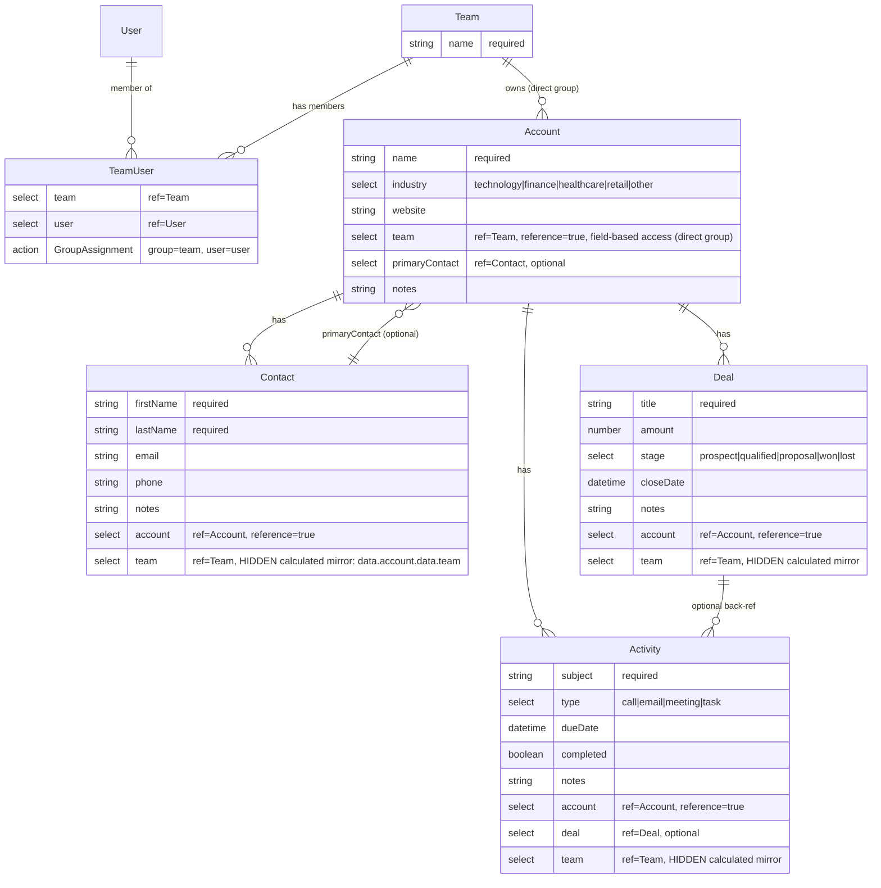
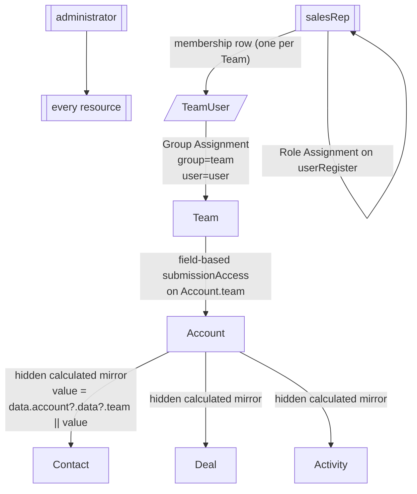

# Resource Map — Complex CRM

A multi-team CRM where sales reps belong to one or more Teams, each Team owns a set of Accounts, and every account-scoped record (Contacts, Deals, Activities) is visible only to members of the owning Team. Admins see everything.

This app exercises **transitive group access**: the group (`Team`) sits two levels above the bottom of the hierarchy. The direct child of the group (`Account`) uses a normal group-reference select with field-based access. Grandchildren (`Contact`, `Deal`, `Activity`) use the hidden, calculated group-mirror pattern to propagate the ACL one more hop.

## Resources

- Team (type: resource) Purpose: the group that owns Accounts; drives group-based access for every account-scoped record. Fields:
  - name: textfield — team name (required) Access: admin-full; all logged-in users can read the Team definition itself Actions:
  - (save only)

- TeamUser (type: resource, join) Purpose: many-to-many between Team and User; registers per-team memberships and triggers the Group Assignment ACL write. Fields:
  - team: select (resource=Team) — the team
  - user: select (resource=User) — the member Access: admin-only (memberships managed by admins) Actions:
  - Group Assignment: group=team, user=user

- Account (type: resource; direct child of Team) Purpose: an organization the sales team works with; directly references its owning Team. Fields:
  - name: textfield — company name (required)
  - industry: select (static values: technology, finance, healthcare, retail, other)
  - website: textfield
  - team: select (resource=Team, reference=true, field-based access) — **owning team; group access propagates from here**
  - primaryContact: select (resource=Contact, optional) — main point of contact at this account
  - notes: textarea Access: admin-full; authenticated users see only Accounts whose Team they belong to (field-based submissionAccess on `team`) Actions:
  - (save only)

- Contact (type: resource; 2 levels below Team) Purpose: an individual person at an Account. Fields:
  - firstName: textfield (required)
  - lastName: textfield (required)
  - email: email
  - phone: phoneNumber
  - notes: textarea
  - account: select (resource=Account, reference=true) — parent account (user-visible)
  - team: select (resource=Team, hidden, calculated from account.team, field-based access) — **invisible mirror; `value = data.account?.data?.team || value;` propagates group access** Access: admin-full; group access via the hidden team mirror Actions:
  - (save only)

- Deal (type: resource; 2 levels below Team) Purpose: a sales opportunity attached to an Account. Fields:
  - title: textfield (required)
  - amount: number
  - stage: select (static values: prospect, qualified, proposal, won, lost)
  - closeDate: datetime (date only)
  - notes: textarea
  - account: select (resource=Account, reference=true) — parent account
  - team: select (resource=Team, hidden, calculated, field-based access) — **invisible mirror for group access** Access: admin-full; group access via the hidden team mirror Actions:
  - (save only)

- Activity (type: resource; 2 levels below Team) Purpose: a touchpoint (call, email, meeting, task) logged against an Account and optionally a specific Deal. Fields:
  - subject: textfield (required)
  - type: select (static values: call, email, meeting, task)
  - dueDate: datetime
  - completed: checkbox
  - notes: textarea
  - account: select (resource=Account, reference=true) — parent account
  - deal: select (resource=Deal, reference=true, optional) — specific deal this activity relates to
  - team: select (resource=Team, hidden, calculated, field-based access) — **invisible mirror for group access** Access: admin-full; group access via the hidden team mirror Actions:
  - (save only)

## Users & Auth

- User resource: default `user` (email + password)
- Login form: `userLogin` (Login action)
- Registration: self-register via `userRegister` — Save forwards to `user` resource, Role Assignment grants `salesRep`, Login action auto-issues JWT
- SSO: none

## Roles

- administrator: full access to all resources and memberships; creates Teams and TeamUser rows
- salesRep: default role on self-registration; access to Accounts, Contacts, Deals, and Activities is narrowed by TeamUser membership at runtime
- authenticated: declared but assigned to nobody in this example — Form.io issues roles only through a Role Assignment action, and this project's `userRegister:role` assigns `salesRep`. A grant naming `authenticated` here would be held by no user.
- anonymous: default for unauthenticated visitors; may reach only login/register forms

## Access Matrix

| Resource | Actor | create | read | update | delete | Notes |
| --- | --- | --- | --- | --- | --- | --- |
| User | administrator | all | all | all | all |  |
| User | salesRep | — | own | own | — | owner-level access to own record; `salesRep` is the role registration actually assigns, so the grant must name it |
| Team | administrator | all | all | all | all | admin creates teams |
| Team | salesRep | — | all | — | — | `read_all` is required, not a convenience: nothing stamps a group row's own `access`, and it must be readable to populate the `team` select whose value authorizes group-based create. Trade-off: every rep can read every Team row |
| TeamUser | administrator | all | all | all | all | admin manages memberships |
| TeamUser | salesRep | — | group | — | — | sees their own teams' membership rows (read-only field-based block on TeamUser.team); `read_own` would be inert — admin creates and therefore owns these rows |
| Account | administrator | all | all | all | all |  |
| Account | salesRep | group | group | group | — | group-via-TeamUser (field-based on Account.team is `write`: read + create + update, no delete — customer records are an audit obligation, so deletion stays with the administrator) |
| Contact | administrator | all | all | all | all |  |
| Contact | salesRep | group | group | group | — | transitive via hidden `team` mirror (`write`) |
| Deal | administrator | all | all | all | all |  |
| Deal | salesRep | group | group | group | — | transitive via hidden `team` mirror (`write`) |
| Activity | administrator | all | all | all | all |  |
| Activity | salesRep | group | group | group | — | transitive via hidden `team` mirror (`write`) |

## ER Diagram

## Access Flow Diagram

Runtime propagation narrative:

1. User signs up on `userRegister` → Save writes into `user` resource → Role Assignment grants `salesRep` → Login issues JWT.
2. Admin creates a `TeamUser(team, user)` row → Group Assignment writes an ACL entry onto that Team submission.
3. `Account.team` carries a field-based `submissionAccess` block (4 entries, empty roles) → Form.io propagates the Team's ACL onto each Account whose `team` matches → `salesRep` can create/read/update Accounts under their Team(s).
4. `Contact` / `Deal` / `Activity` each carry a hidden `team` select mirroring `Account.team` — `calculateValue: value = data.account?.data?.team || value;`, `refreshOn: account`, `hidden: true`, same field-based `submissionAccess` (`write`). The mirror propagates the same ACL to the grandchild row on submit.

Owner rules: none — all row-level access is group- or role-driven.

## Companion artifact

`template.json` in this directory is the structured Form.io project-export companion to this document. Use this `.md` for architectural intent; use the `.json` for exact field shapes, component JSON, and action settings.
