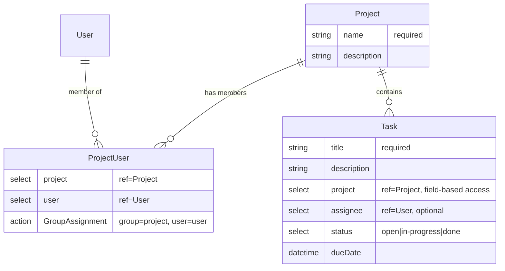
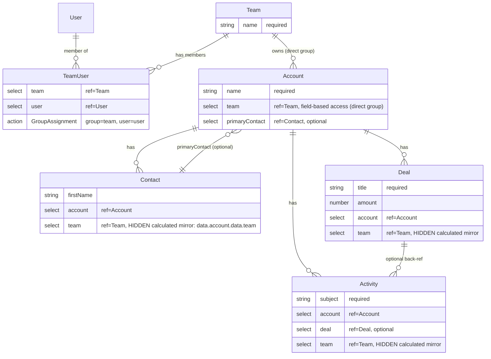
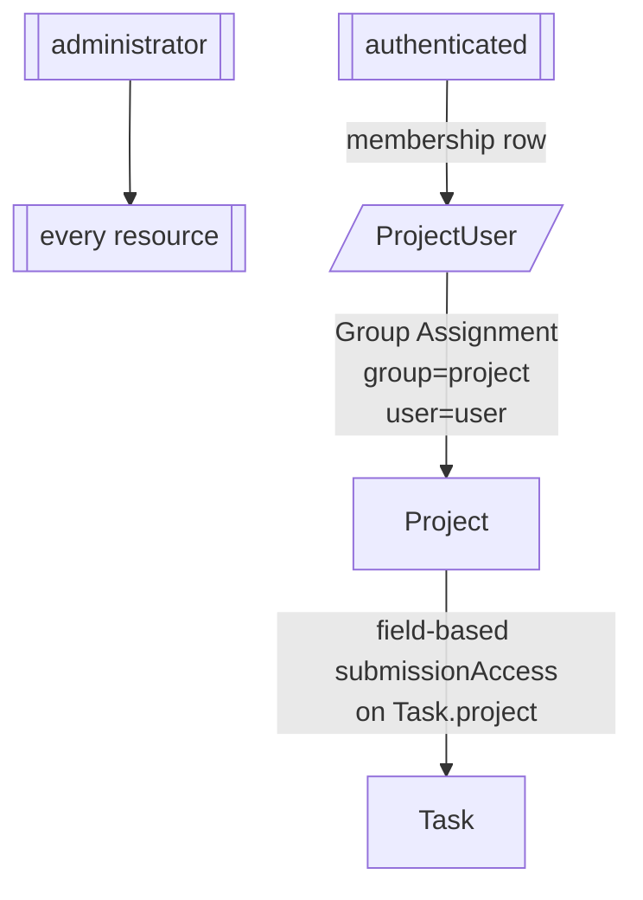
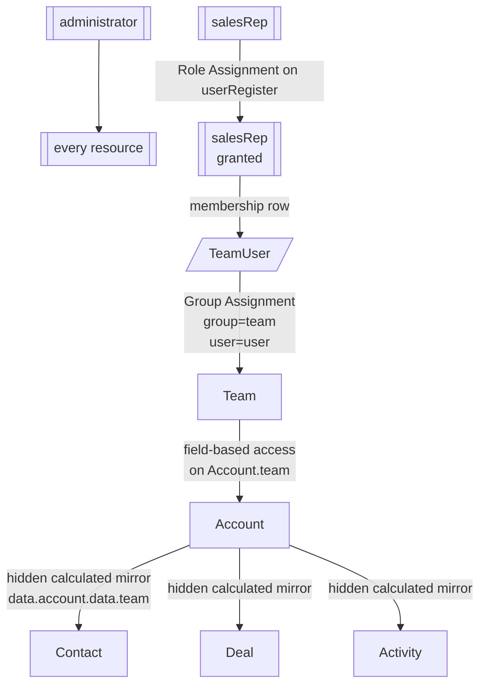
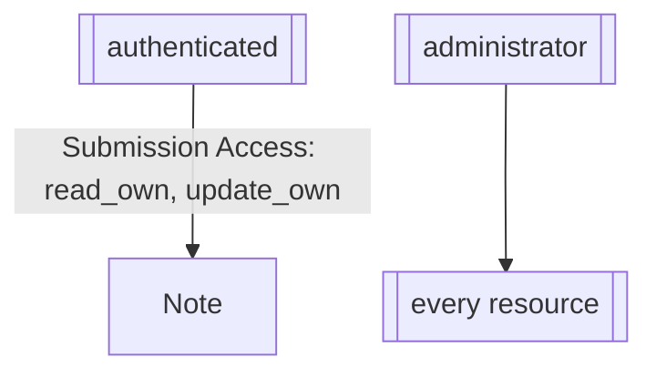
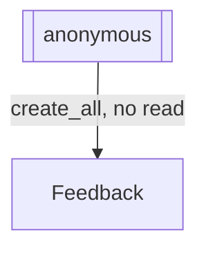

# `template.md` reference

Canonical shape for the Resource Map artifact emitted by `formio-resource-planner` Phase B alongside `template.json`. Downstream skills (`formio-angular/formio-angular-resources`, future `formio-react`, etc.) read `template.md` for architectural intent — what resources exist, how they relate, who can do what — and consult the paired `template.json` for field-level Form.io JSON shapes.

Treat the two files as a pair: same basename, same timestamp on collision (`template-20260423T153000Z.md` + `template-20260423T153000Z.json`).

## Why markdown in addition to JSON

`template.json` is structurally complete but expensively flat. A consumer reading it has to reassemble the story by walking reference selects, decoding action settings, and pattern-matching `submissionAccess` blocks. `template.md` captures the same story in the form the planner already reasoned in — named resources, labelled relationships, access story prose, and two ASCII diagrams — so downstream skills do not re-derive intent from raw JSON.

`template.md` is the seed. `template.json` is the reference.

## Required section order

Sections appear in this exact order. Skills and graders rely on section headings — do not rename them. Every heading listed here is mandatory EXCEPT `## Forms`, which is **conditional**: include it (immediately after `## Resources`) only when the app has bespoke data-collection forms, and omit the whole heading otherwise. For the remaining mandatory headings, omit only the body when the section genuinely has nothing (e.g., `Users & Auth` when the app is anonymous, then write `- None. App is public.` underneath).

```markdown
# Resource Map — <App Name>

<1–2 sentence app summary in plain language>

## Resources

## Forms

## Users & Auth

## Roles

## Access Matrix

## ER Diagram

## Access Flow Diagram

## Companion artifact
```

## Resources section

One block per resource. Terse — one sentence per purpose, one clause per field. Join resources are tagged inline. Transitive group-access mirror fields are called out so consumers know which reference selects are user-facing vs plumbing.

```markdown
- <ResourceName> (type: resource)
  Purpose: <1 sentence>
  Fields:
    - <key>: <component> — <description>
    - ...
  Access: <owner | group-via-<join> | role(<roles>) | public>
  Actions:
    - <action name>: <key settings>

- <JoinResourceName> (type: resource, join)
  Purpose: <which relationship this implements>
  Fields:
    - <leftKey>: select (resource=<Left>)
    - <rightKey>: select (resource=<Right>)
  Access: <who can read/write the join rows>
  Actions:
    - Group Assignment: group=<leftKey>, user=<rightKey>   ← only when this join governs access
```

For transitive group access, call out the hidden mirror on every grandchild:

```markdown
- team: select (resource=Team, hidden, calculated from account.team, field-based access) — **invisible mirror that propagates group access from Account's team**
```

## Forms section (conditional)

Include this section ONLY when the app has bespoke, purpose-specific data-collection forms — job applications, surveys, RSVPs, intake/feedback forms. A **Form** (`type: form`) captures a response for one interaction rather than a reusable record; see `SKILL.md` → "Resources vs. Forms — the core modeling decision" for the classification rule. Omit the entire `## Forms` heading for pure data-model apps.

Auth forms (login / register) are NOT listed here — they belong under `## Users & Auth`. This section is only for application-level bespoke forms.

One block per form. Call out which Resource (if any) the form **references** (a record established earlier in the flow) and how. A bespoke form references an existing record — it never creates that record on submit; see `SKILL.md` → "Resources vs. Forms" and `formio-application/references/resource-vs-form-anti-pattern.md` → "Using Resources within Forms" for the anti-pattern.

```markdown
- <FormName> (type: form) Purpose: <1 sentence — the specific interaction this form captures> References: <ResourceName via disabled pre-selected Select | owner (1:1 with the user) | none> Fields:
  - <key>: <component> — <bespoke field specific to this form>
  - ... Access: <who can submit / who can read> Actions:
  - <action name>: <key settings> ← Save to its OWN submission only; never a Save that creates the referenced Resource
```

Forms may also appear in the ER Diagram (wired to any Resource they reference) and in the Access Flow Diagram when their submission access is non-trivial, but this is optional — the grader does not require forms to appear in either diagram.

## Users & Auth section

Bulleted facts only. Keep it parseable.

```markdown
- User resource: <default `user` | custom `<name>`>
- Login form: <form machineName> (Login action)
- Login resources: <the Login action's `settings.resources` — `user` by default; `admin`, or `user` + `admin`, only when the app itself must authenticate administrators>
- Admin operations: <each admin-only workflow in one line — e.g. "Seed initial Project rows; create ProjectUser membership rows; assign `administrator` to specific users." — noting they run through the Form.io project portal, not the app. `None.` when the app has none.>
- Registration: <self-register via <form> with Role Assignment → <role> | admin-invite only | none>
- SSO: <none | OIDC | SAML | LDAP>
- Custom JWT: <yes | no>
```

The `Admin operations` line is what `phase-b-emission.md` → "Admin-only work goes through the Form.io portal, not the app login form" and `planning-rules.md` → "Login" both point at: admin-only responsibilities are captured here rather than designed into the app's login surface.

When `SSO` is anything other than `none`, or `Custom JWT` is `yes`, downstream auth configuration (OAuth/SAML/LDAP Role Mapping, Token Swap, `JWT_SECRET`-signed Custom JWT, email-token auth, 2FA, reCAPTCHA) is owned by the `formio-auth` skill — hand off there after this Resource Map is approved.

## Roles section

One bullet per role. Include the three Form.io defaults (`administrator`, `authenticated`, `anonymous`) plus any custom roles.

```markdown
- administrator: <capability summary>
- <customRole>: <capability summary>
- authenticated: <capability summary>
- anonymous: <capability summary>
```

## Access Matrix section

A truth table of CRUD capability per resource × actor. Actors are roles and groups (where a group-based rule is in play). Cell values use this vocabulary — keep it small and consistent so consumers can match on exact strings:

| Token | Meaning |
| --- | --- |
| `all` | Unrestricted across every submission of this resource. |
| `own` | Only submissions the actor owns (Form.io Owner rule). |
| `group` | Only submissions whose group the actor belongs to (group-via-join). |
| `group(<j>)` | Group access specifically through join `<j>` — use when multiple groups apply. |
| `role(<r>)` | Gated by role `<r>` layered on top of another rule. |
| `—` | No access. |

### Token → `template.json` mapping

Every non-`—` cell must land in the emitted `template.json`. This is the mapping Phase B realizes; `<actor>` is the row's actor role, `<op>` is the column.

| Cell | What Phase B emits |
| --- | --- |
| `create` / `all` | `{ "type": "create_all", "roles": ["<actor>"] }` in the resource's `submissionAccess` |
| `create` / `own` | `{ "type": "create_own", "roles": ["<actor>"] }` |
| `create` / `group` | Nothing in `submissionAccess`. A create-conferring type (`create`, `write`, or `admin`) in the field-based block on the group-reference `select` — the server authorizes the POST from the group reference in the payload. Adding `create_own` here would wrongly permit creating rows outside the group. |
| `read`/`update`/`delete` `all` | `{ "type": "<op>_all", "roles": ["<actor>"] }` |
| `read`/`update`/`delete` `own` | `{ "type": "<op>_own", "roles": ["<actor>"] }` |
| `read`/`update`/`delete` `group` | Nothing in `submissionAccess`. The field-based block must carry a type conferring that operation: `read`/`write`/`admin` for read, `update`/`write`/`admin` for update, `delete`/`admin` for delete. |
| `role(<r>)` | The underlying rule's entry, with `<r>` in its `roles` array |
| `—` | Nothing. |

**Two asymmetries to get right.** First, `delete | group` and `delete | —` are a real fork: the four-entry CRUD block (equivalently `admin`) lets any group member permanently delete any of the group's rows, while `write` gives read + create + update and withholds delete. The matrix column and the block must agree, and when they disagree the block wins at runtime. Second, a **group resource** can never carry `group` in its own row: nothing stamps a group record's own `access`, and membership does not confer read of it. The group needs `read_all` for the end-user role — which is also what lets the `dataSrc: "resource"` select populate, without which no group reference reaches the payload and every group-scoped create fails. Record that as `all`, and note the trade-off that every end user can then read every group row.

Phase B verifies each matrix row against the arrays it emitted before handing off: for every row, for every column, confirm the mapping above actually appears. `packages/skill-tests/src/formio-resource-planner/example-access-consistency.test.ts` enforces this mapping over the checked-in examples.

Layout:

```markdown
| Resource | Actor | create | read | update | delete | Notes |
| --- | --- | --- | --- | --- | --- | --- |
| Project | administrator | all | all | all | all | full admin |
| Project | authenticated | — | all | — | — | Project is the group — `read_all` so the project select can populate; never `group` in a group resource's own row |
| Task | administrator | all | all | all | all |  |
| Task | authenticated | group | group | group | — | inherits via Task.project; the block is `write`, so members cannot delete. The checked-in `examples/task-manager/` makes the OTHER choice for the same resource — a four-entry block and `delete | group` — because a task list is disposable; both are correct, and the matrix must say whichever the block does |
| ProjectUser | administrator | all | all | all | all | admin-managed membership |
| ProjectUser | authenticated | — | group | — | — | read-only field-based block on ProjectUser.project; `own` would be inert — the admin creates and owns these rows |
```

One row per (resource, actor) pair with a non-trivial rule. Do not enumerate irrelevant actors — if a resource is admin-only, two rows (administrator + `authenticated: — / — / — / —`) are sufficient.

## ER Diagram section

Mermaid `erDiagram`. Every resource is an entity. Relationships use Mermaid's cardinality syntax:

| Cardinality         | Mermaid syntax |
| ------------------- | -------------- |
| 1:1 mandatory       | `\|\|--\|\|`   |
| 1:N, one required   | `\|\|--o{`     |
| N:N, via join       | `}o--o{`       |
| 1:N, child optional | `\|o--o{`      |

Every entity declaration gets its key fields listed in the body — at minimum any reference selects and whether they are `reference=true`, `hidden`, or `calculated`. This is what downstream skills parse to know which fields are real vs plumbing.

Join resources appear as their own entity with the two sides wired to it using `}o--||` on each side.

Use a `%%` comment line above each cardinality to name the relationship when it is not obvious (e.g., `%% Group Assignment on ProjectUser writes Project's ACL`).

Example (direct-child group pattern — Task Manager):

````markdown

````

Example (transitive group pattern — Complex CRM):

````markdown

````

## Access Flow Diagram section

Mermaid `flowchart TD`. Shows how access actually propagates at runtime — which role the user starts with, which memberships grant which ACLs, and which field-based rules carry those ACLs onto downstream resources. This is the diagram the `Access Matrix` summarises and the `ER Diagram` does not show.

Conventions:

- Roles are `[[ Role ]]` subroutine-shaped nodes (visually distinct from resources).
- Resources are plain `[ Resource ]` rectangles.
- Joins are `[/ Join /]` parallelogram-shaped nodes.
- Arrow labels name the mechanism: `"Group Assignment group=X user=Y"`, `"field-based access on <field>"`, `"calculated mirror: <expr>"`, `"Role Assignment → <role>"`.
- Admin bypass ("admin sees everything") is a single edge from the admin role to a `[[ every resource ]]` terminal.
- Owner-based rules get an edge labelled `"Submission Access: read_own, update_own"` from the role to the resource.
- When the app is anonymous, the whole diagram collapses to one edge: `Anonymous --> Resource` with `"create_all, no read"`.

Example (Task Manager — direct-child group):

````markdown

````

Example (Complex CRM — transitive group):

````markdown

````

Example (owner-only — private notes):

````markdown

````

Example (anonymous feedback — no auth):

````markdown

````

## Why Mermaid in the file (and ASCII in the chat)

`template.md` is consumed primarily by downstream skills and humans viewing the file in GitHub / IDE preview / Obsidian / any modern Markdown renderer. Mermaid scales beyond what ASCII handles cleanly (7+ resources, transitive mirrors, multiple joins) and gives downstream LLMs deterministic cardinality semantics (`||--o{`, `}o--o{`) instead of free-form ASCII labels.

But the Phase A approval gate happens in the terminal, where the user must review and approve BEFORE Phase B writes any files. Mermaid is unrenderable in a terminal — the user would be approving a wall of code. So Phase A uses the ASCII-diagram shape documented in [`interview-guide.md`](interview-guide.md)'s "Phase A — Resource Map for review" section, and Phase B's `template.md` file uses Mermaid. Both diagrams show the same topology — planner generates them from the same internal model in one run, so drift is bounded to a single emission.

When a planner iteration emits Mermaid that is syntactically wrong (e.g., missing closing brace), the companion `## Access Matrix` table is still authoritative — downstream skills can fall back to reading the matrix and the Resources section.

## Companion artifact section

Closing pointer so a consumer who opened `template.md` first knows where to find the structured shape:

```markdown
## Companion artifact

`template.json` in this directory is the structured Form.io project-export companion to this document. Use this `.md` for architectural intent; use the `.json` for exact field shapes, component JSON, and action settings.
```

## File pairing rules

- `template.md` + `template.json` are always written together in Phase B.
- Default names: `./template.md` and `./template.json` in cwd.
- Collision: if either file exists, append the SAME sortable UTC timestamp to both (`template-<YYYYMMDDTHHMMSSZ>.md`, `template-<YYYYMMDDTHHMMSSZ>.json`) so the pair stays matched. Report both chosen filenames in the Phase B confirmation.
- Never write one without the other.

## Chat-output rules

Two surfaces, two rendering strategies:

**Phase A (chat, approval gate):**

1. Full Resource Map with ASCII ER Diagram and ASCII Access Flow Diagram rendered inline. This is what the user visually reviews and approves.
2. The ASCII shapes used here are documented in [`interview-guide.md`](interview-guide.md)'s "Phase A — Resource Map for review" section.
3. No file write yet.

**Phase B (file + chat, after approval):**

1. `template.md` is written to disk containing Mermaid `erDiagram` + Mermaid `flowchart TD` blocks (as specified above) — NOT ASCII. The file is the seed downstream skills read; Mermaid gives them semantic edges and renders natively in GitHub/IDE preview.
2. The full `template.md` is echoed as a fenced ` ```markdown ` block in the transcript — raw, including the ` ```mermaid ` fences unrendered. User does not re-review the Mermaid; they already approved the Phase A ASCII.
3. The full `template.json` is echoed as a fenced ` ```json ` block after it.
4. A one-line confirmation: `Wrote ./template.md and ./template.json.`
5. The "Next steps" block.

**Drift contract:** Phase A's ASCII and Phase B's Mermaid describe the same topology. Planner generates both from the same internal model in one run. Resource names, join names, cardinalities, and access mechanisms MUST match one-to-one between surfaces. When the grader runs, it cross-checks: every resource declared in `## Resources` must appear both in the Phase A ASCII (when preserved) and as a Mermaid node in Phase B's `template.md`.
